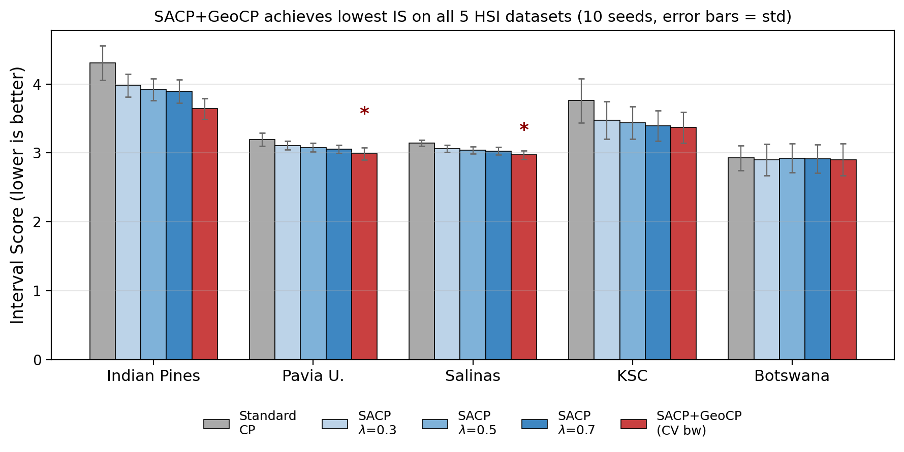

# GeoCP_RS — Spatially-adaptive conformal prediction for remote-sensing HSI

[](https://www.python.org/downloads/)
[](LICENSE)

`geocp_rs` is a **post-hoc, classifier-agnostic uncertainty quantification** method for hyperspectral image (HSI) classification. It produces prediction *sets* (not just point predictions) with a finite-sample marginal coverage guarantee, and adapts the prediction-set size to the local spatial structure of the scene.

The method (**SACP+GeoCP**) composes two existing spatial extensions of split conformal prediction:

- **SACP** — 8-neighbor smoothing of APS nonconformity scores ([Liu et al., 2024](https://arxiv.org/abs/2409.01236))
- **GeoCP** — geographic-kernel local quantile ([Lou, Luo, Meng, 2024](https://arxiv.org/abs/2412.08661))

On 5 standard HSI benchmarks × 10 seeds = **50 runs**, SACP+GeoCP attains the lowest mean **interval score** on *all five* datasets, with pooled paired $t$-test $p = 2.0 \times 10^{-7}$ (Wilcoxon $p = 3.6 \times 10^{-5}$) over the SACP baseline.

<p align="center">
  
</p>

## Quick start

### Install the package

```bash
git clone https://github.com/pengtum/GeoCP_RS.git
cd GeoCP_RS
pip install -e .
# or: pip install -e '.[all]' to include torch / matplotlib / pandas
```

### Try it on synthetic data (no GPU, no data download)

```bash
python examples/quick_start.py
```

Expected output:
```
Quick start OK
  Coverage : 0.901  (target 0.9)
  Mean size: 1.52
  IS       : 3.506
  Bandwidth: 10.0
```

### Reproduce the paper on all 5 HSI datasets

```bash
# Download datasets + run 5 × 10 = 50 experiments (GPU recommended)
geocp-rs-run-all --data-dir ./data --out ./results --download

# Aggregate per-seed pickles into summary tables
geocp-rs-aggregate --in ./results

# Regenerate all paper figures from per_seed.csv
geocp-rs-figures --in ./results --out ./figures
```

Or run the equivalent one-click Colab notebook:

```
notebooks/sacp_geocp_colab.ipynb
```

It mounts Google Drive, checkpoints every seed atomically, and auto-resumes on runtime failure.

## Minimal code example

```python
import numpy as np
from geocp_rs import run_sacp_geocp, coverage_and_size, interval_score

# 1. Get softmax probabilities from ANY classifier
probs_cal  = ...   # (n_cal, K)
probs_test = ...   # (n_test, K)

# 2. Provide pixel coordinates on the image grid
coords_cal  = ...  # (n_cal, 2) row/col
coords_test = ...  # (n_test, 2) row/col
cal_flat_idx  = ...   # flat indices (row * w + col)
test_flat_idx = ...
y_cal = ...           # (n_cal,) true class labels

# 3. Run SACP+GeoCP
result = run_sacp_geocp(
    probs_cal=probs_cal, probs_test=probs_test, y_cal=y_cal,
    coords_cal_rowcol=coords_cal, coords_test_rowcol=coords_test,
    grid_shape=(H, W),
    cal_flat_idx=cal_flat_idx, test_flat_idx=test_flat_idx,
    alpha=0.1,          # target miscoverage
    lmd=0.5,            # SACP smoothing weight (default 0.5)
    bandwidth=None,     # use median cal-cal distance, or pick via CV
)

pred_sets = result["pred_sets"]   # list of list[int], per test pixel
local_q   = result["local_q"]     # per-pixel GeoCP thresholds
```

The method is **classifier-agnostic**: any segmentation backbone (U-Net, DeepLab, SegFormer, Mask2Former, 3D-CNN, Bayesian CNN, ensembles, …) that outputs per-class probabilities works. No retraining, no gradient access, no architecture change.

## Headline results

| Dataset | 3D-CNN acc | Std CP IS | SACP(0.5) IS | **SACP+GeoCP IS** | Δ% | paired $p$ |
|---|---|---|---|---|---|---|
| Indian Pines | 0.688 | 4.31 | 3.92 | **3.64** | +7.14% | 1.8 × 10⁻⁵ |
| Pavia U.     | 0.862 | 3.20 | 3.08 | **2.99** | +3.05% | 0.009 |
| Salinas      | 0.883 | 3.14 | 3.04 | **2.97** | +2.24% | 0.014 |
| KSC          | 0.811 | 3.76 | 3.44 | **3.37** | +1.97% | 0.051 |
| Botswana     | 0.949 | 2.93 | 2.92 | **2.90** | +0.70% | 0.38 |
| **Pooled (50 runs)** | — | — | — | — | **+3.01%** | **2.0 × 10⁻⁷** |

The improvement correlates **inversely** with classifier accuracy ($r = -0.92$, $p = 0.027$): SACP+GeoCP helps most when the underlying classifier is uncertain.

## Repository layout

```
GeoCP_RS/
├── README.md                         # this file
├── LICENSE                           # MIT
├── pyproject.toml                    # pip-installable metadata
│
├── geocp_rs/                         # ⭐ the installable Python package
│   ├── __init__.py                   # re-exports the public API
│   ├── core.py                       # APS, conformal_quantile, weighted_quantile
│   ├── sacp.py                       # SACP score smoothing
│   ├── geocp.py                      # GeoCP local threshold
│   ├── pipeline.py                   # run_sacp_geocp(...) Algorithm 1
│   ├── metrics.py                    # coverage_and_size, interval_score
│   ├── models.py                     # CNN3D backbone (Hamida et al. 2018)
│   ├── datasets.py                   # HSI dataset loaders + URLs
│   ├── train.py                      # 3D-CNN training loop
│   ├── evaluate.py                   # run all CP variants with CV bw
│   ├── viz.py                        # 5×4 qualitative grid
│   └── cli.py                        # console-script entry points
│
├── scripts/                          # executable experiment drivers
│   ├── run_all_experiments.py        # train + eval 5 ds × 10 seeds
│   ├── aggregate_results.py          # build summary.json / CSV / TeX / stats
│   └── make_figures.py               # regenerate all paper figures
│
├── notebooks/
│   └── sacp_geocp_colab.ipynb        # self-contained Colab notebook
│
├── examples/
│   └── quick_start.py                # 30-line synthetic-data demo
│
├── tests/
│   └── test_core.py                  # unit tests for CP primitives
│
├── docs/                             # extended documentation
│   ├── INSTALLATION.md
│   ├── USAGE.md
│   ├── ALGORITHM.md                  # step-by-step derivation
│   ├── EXPERIMENT_PROTOCOL.md        # how to reproduce every number
│   └── RESULTS_ANALYSIS.md           # detailed per-dataset breakdown
│
├── results/                          # committed experimental outputs
│   ├── summary.json                  # mean ± std per (ds, method)
│   ├── per_seed.csv                  # raw 50-row table
│   ├── stats.json                    # t-test / Wilcoxon p-values
│   ├── results_table.tex             # LaTeX table for paper
│   ├── run_log.txt                   # Colab execution log
│   └── checkpoints/                  # 50 per-seed pickles (28 MB total)
│
└── figures/                          # paper figures (PDF + PNG)
```

> The LaTeX manuscript and compiled PDF live in a separate manuscript repository and are not bundled with the code package. This repo only ships the implementation, experiments, and results needed to reproduce the numbers.

## Installation options

| What you want | Install command |
|---|---|
| Just the CP primitives (numpy only) | `pip install -e .` |
| + 3D-CNN training (needs PyTorch) | `pip install -e '.[torch]'` |
| + Figure generation (needs matplotlib / pandas) | `pip install -e '.[viz]'` |
| + Everything (recommended for reproduction) | `pip install -e '.[all]'` |
| + Dev tools (pytest, ruff) | `pip install -e '.[dev]'` |

See [`docs/INSTALLATION.md`](docs/INSTALLATION.md) for platform-specific notes (Apple Silicon MPS, CUDA, Colab).

## Documentation map

| Document | Read when you want to... |
|---|---|
| [`docs/INSTALLATION.md`](docs/INSTALLATION.md) | Install the package on your machine |
| [`docs/USAGE.md`](docs/USAGE.md) | Call the API on your own HSI data |
| [`docs/ALGORITHM.md`](docs/ALGORITHM.md) | Understand the algorithm step by step with proofs |
| [`docs/EXPERIMENT_PROTOCOL.md`](docs/EXPERIMENT_PROTOCOL.md) | Reproduce the paper's numbers exactly |
| [`docs/RESULTS_ANALYSIS.md`](docs/RESULTS_ANALYSIS.md) | Deep-dive into per-dataset results and statistics |

## Citation

If you use `geocp_rs` in your research, please cite the accompanying manuscript (forthcoming) and the two methods it composes:

```bibtex
@article{liu2024sacp,
  title   = {Spatial-Aware Conformal Prediction for Trustworthy Hyperspectral Image Classification},
  author  = {Liu, Kangdao and Sun, Tianhao and Zeng, Hao and Zhang, Yongshan and Pun, Chi-Man and Vong, Chi-Man},
  journal = {arXiv preprint arXiv:2409.01236},
  year    = {2024}
}

@article{lou2024geoconformal,
  title   = {GeoConformal Prediction: A Model-Agnostic Framework of Measuring the Uncertainty of Spatial Prediction},
  author  = {Lou, Xiayin and Luo, Peng and Meng, Liqiu},
  journal = {arXiv preprint arXiv:2412.08661},
  year    = {2024}
}

@inproceedings{tibshirani2019conformal,
  title     = {Conformal Prediction Under Covariate Shift},
  author    = {Tibshirani, Ryan J. and Barber, Rina Foygel and Cand{\`e}s, Emmanuel J. and Ramdas, Aaditya},
  booktitle = {Advances in Neural Information Processing Systems (NeurIPS)},
  year      = {2019}
}
```

## Acknowledgements

The base 3D-CNN code (`geocp_rs.models.CNN3D`) follows Hamida et al. (2018). We thank the authors of SACP and GeoConformal Prediction for releasing their reference implementations.

## License

Code: MIT (see [`LICENSE`](LICENSE)). Paper text: CC-BY 4.0. Datasets follow the licenses of their respective upstreams (EHU Computational Intelligence Group for IP/PU/SA/KSC/Botswana).
